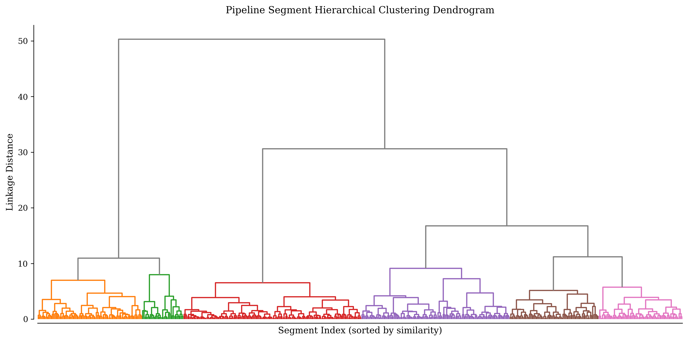
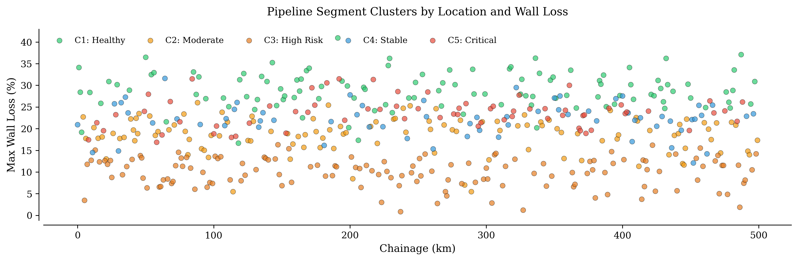

# Finding Hidden Pipeline Health Patterns with Hierarchical Clustering

## When Averages Hide the Truth

A pipeline integrity engineer reviews inline inspection (ILI) data for 500 km of pipeline divided into 2,000 segments. The average wall loss is 12%. Management asks: "Is this acceptable?"

The answer depends on what the average hides. Are 90% of segments pristine with 10% severely corroded? Or is every segment uniformly degraded? Are coastal segments behaving differently from desert segments? Traditional dashboards show summary statistics—mean wall loss, maximum pit depth, total anomalies—but these metrics obscure natural groups that share similar degradation signatures.

An operator might flag segments exceeding a single threshold (e.g., wall loss > 20%), but this binary classification misses nuance. A segment with 18% wall loss, poor coating, and high soil resistivity is riskier than a 22% wall loss segment with excellent CP and recent remediation. Thresholds can't capture these multivariate patterns.

Hierarchical clustering solves this. By grouping segments based on multiple features—wall loss, cathodic protection (CP) potential, soil resistivity, coating condition, and historical inspection trends—you uncover natural health regimes that inform targeted integrity management. This article demonstrates a working implementation using Apache Spark, SciPy, and Databricks.

---

## The Problem: Binary Thresholds vs. Complex Degradation Signatures

### Why Simple Thresholds Fail

In Scenario 1, two segments both have 15% average wall loss. Segment A shows stable CP (-1,050 mV), dense coating, low soil resistivity (1,500 Ω·cm), and no active corrosion. Segment B shows marginal CP (-820 mV), degraded coating, high soil resistivity (8,000 Ω·cm), and active pitting. A threshold-based system treats them identically. In reality, Segment B requires immediate attention while Segment A can wait for the next scheduled inspection.

In Scenario 2, three segments exceed 20% wall loss. Segment C has localized external corrosion at a road crossing but is otherwise stable. Segment D shows widespread internal corrosion from wet gas that is accelerating. Segment E has a manufacturing anomaly (lamination) that is not progressing. All three exceed the threshold, but root causes and risk profiles differ. Treating them uniformly wastes resources.

### What Clustering Reveals

Hierarchical clustering identifies groups of segments with similar multivariate signatures, enabling several key capabilities. Differentiated inspection intervals allow low-risk clusters to get 5-year cycles while high-risk clusters get annual digs. Root cause analysis is facilitated as clusters often map to physical causes (coating failure, soil chemistry, operational stress). Resource optimization focuses CP upgrades on clusters where coating degradation dominates. Regulatory compliance is demonstrated through risk-based decision-making with transparent groupings.

---

## Solution Architecture: Pipeline Health Clustering on Databricks

```
┌─────────────────────────┐
│  Data Sources           │
│  • ILI tool outputs     │
│  • CP survey data       │
│  • Soil resistivity     │
│  • Coating inspections  │
│  • GIS segment metadata │
└───────────┬─────────────┘
            │
            ▼
┌─────────────────────────┐
│  Delta Lake (Bronze)    │
│  • Raw ILI anomalies    │
│  • Raw CP readings      │
│  • Raw soil samples     │
└───────────┬─────────────┘
            │
            ▼
┌─────────────────────────┐
│  Feature Engineering    │
│  (Spark SQL + Python)   │
│  • Aggregate per segment│
│  • Join spatial layers  │
│  • Compute risk metrics │
└───────────┬─────────────┘
            │
            ▼
┌─────────────────────────┐
│  Delta Lake (Silver)    │
│  • Segment-level features│
└───────────┬─────────────┘
            │
            ▼
┌─────────────────────────┐
│  Clustering (SciPy)     │
│  • Hierarchical (Ward)  │
│  • Dendrogram           │
│  • Cluster assignment   │
└───────────┬─────────────┘
            │
            ▼
┌─────────────────────────┐
│  Delta Lake (Gold)      │
│  • Segment + cluster_id │
│  • Cluster profiles     │
└───────────┬─────────────┘
            │
            ▼
┌─────────────────────────┐
│  Dashboards & Actions   │
│  • Databricks SQL viz   │
│  • Integrity work orders│
│  • Regulatory reports   │
└─────────────────────────┘
```

Key components:
- Bronze tables: Raw ILI, CP, soil data ingested from field tools.
- Silver tables: Segment-level features engineered from bronze data.
- SciPy clustering: Hierarchical clustering (Ward linkage) on normalized features.
- Gold tables: Segments tagged with cluster IDs, ready for operational dashboards.

---

## Data Model: What Features Define Pipeline Health?

### Core Features (Per Segment)

| Feature | Description | Source | Unit |
|---------|-------------|--------|------|
| `avg_wall_loss_pct` | Mean metal loss over segment | ILI | % |
| `max_wall_loss_pct` | Worst-case metal loss | ILI | % |
| `anomaly_count` | Number of reportable features | ILI | count |
| `avg_cp_potential_mv` | Mean cathodic protection potential | CP survey | mV |
| `cp_std_mv` | CP variability (higher = instability) | CP survey | mV |
| `soil_resistivity_ohm_cm` | Average soil resistivity | Soil survey | Ω·cm |
| `coating_condition` | Categorical: Excellent/Good/Fair/Poor | Field inspection | enum |
| `years_since_last_ili` | Time since last ILI run | Metadata | years |
| `segment_length_m` | Physical length | GIS | meters |
| `operating_pressure_mpa` | Typical operating pressure | SCADA | MPa |

### Derived Features

```python
# Corrosion rate (requires historical ILI data)
corrosion_rate = (wall_loss_current - wall_loss_previous) / years_between_ili

# CP adequacy flag
cp_adequate = (avg_cp_potential_mv < -850)  # Typical criterion

# Risk score (simple weighted combination)
risk_score = (
    0.4 * max_wall_loss_pct +
    0.3 * (1 - cp_adequate) * 100 +
    0.2 * np.log1p(soil_resistivity_ohm_cm / 1000) +
    0.1 * anomaly_count
)
```

---

## Feature Engineering in Spark SQL

### Aggregating ILI Anomalies Per Segment

```sql
CREATE OR REPLACE TABLE silver.segment_ili_features AS
SELECT
  segment_id,
  AVG(metal_loss_pct) AS avg_wall_loss_pct,
  MAX(metal_loss_pct) AS max_wall_loss_pct,
  COUNT(*) AS anomaly_count,
  SUM(CASE WHEN metal_loss_pct > 30 THEN 1 ELSE 0 END) AS critical_anomaly_count
FROM bronze.ili_anomalies
WHERE inspection_date = (SELECT MAX(inspection_date) FROM bronze.ili_anomalies)
GROUP BY segment_id;
```

### Joining CP Survey Data

```sql
CREATE OR REPLACE TABLE silver.segment_cp_features AS
SELECT
  segment_id,
  AVG(cp_potential_mv) AS avg_cp_potential_mv,
  STDDEV(cp_potential_mv) AS cp_std_mv,
  MIN(cp_potential_mv) AS min_cp_potential_mv
FROM bronze.cp_surveys
WHERE survey_date >= DATE_SUB(CURRENT_DATE(), 365)  -- Last year
GROUP BY segment_id;
```

### Unified Feature Table

```sql
CREATE OR REPLACE TABLE silver.segment_features AS
SELECT
  s.segment_id,
  s.segment_length_m,
  s.operating_pressure_mpa,
  s.coating_condition,
  s.years_since_last_ili,
  ili.avg_wall_loss_pct,
  ili.max_wall_loss_pct,
  ili.anomaly_count,
  ili.critical_anomaly_count,
  cp.avg_cp_potential_mv,
  cp.cp_std_mv,
  cp.min_cp_potential_mv,
  soil.avg_soil_resistivity_ohm_cm
FROM bronze.segments s
LEFT JOIN silver.segment_ili_features ili ON s.segment_id = ili.segment_id
LEFT JOIN silver.segment_cp_features cp ON s.segment_id = cp.segment_id
LEFT JOIN silver.segment_soil_features soil ON s.segment_id = soil.segment_id
WHERE ili.avg_wall_loss_pct IS NOT NULL;  -- Only segments with ILI data
```

---

## Hierarchical Clustering with SciPy

### Why Hierarchical Clustering?

Hierarchical clustering offers three key advantages. First, it's interpretable as the dendrogram shows how segments merge into clusters. Second, it requires no pre-specified K, unlike K-means where you need to know the number of clusters upfront. Third, the hierarchical structure reveals nested groupings (e.g., "High Risk" splits into "Coating Failure" versus "CP Deficiency").

### Implementation

```python
import pandas as pd
import numpy as np
from scipy.cluster.hierarchy import linkage, dendrogram, fcluster
from scipy.spatial.distance import pdist
from sklearn.preprocessing import StandardScaler
import matplotlib.pyplot as plt

# Load segment features from Delta table
df = spark.table('silver.segment_features').toPandas()

# Select numeric features for clustering
features = [
    'avg_wall_loss_pct',
    'max_wall_loss_pct',
    'anomaly_count',
    'critical_anomaly_count',
    'avg_cp_potential_mv',
    'cp_std_mv',
    'avg_soil_resistivity_ohm_cm',
    'years_since_last_ili',
    'operating_pressure_mpa'
]

X = df[features].fillna(df[features].median())

# Normalize features
scaler = StandardScaler()
X_scaled = scaler.fit_transform(X)

# Compute linkage (Ward minimizes within-cluster variance)
Z = linkage(X_scaled, method='ward')

# Cut dendrogram at height that yields ~5 clusters
cluster_labels = fcluster(Z, t=5, criterion='maxclust')
df['cluster_id'] = cluster_labels

# Save to Delta
result_df = spark.createDataFrame(df[['segment_id', 'cluster_id']])
result_df.write.mode('overwrite').saveAsTable('gold.segment_clusters')
```

Key choices:
- Ward linkage: Minimizes within-cluster variance (similar to K-means objective).
- StandardScaler: Prevents features with large scales (e.g., soil resistivity in Ω·cm) from dominating.
- Median imputation: Handles missing values conservatively.

---

## Visualizing the Dendrogram

```python
plt.rcParams['font.family'] = 'serif'
fig, ax = plt.subplots(figsize=(12, 6))

dendrogram(Z, ax=ax, no_labels=True, color_threshold=Z[-5, 2])

ax.set_xlabel('Segment Index (sorted by similarity)', fontsize=11)
ax.set_ylabel('Linkage Distance', fontsize=11)
ax.set_title('Pipeline Segment Hierarchical Clustering Dendrogram', fontsize=12, pad=15)

ax.spines['top'].set_visible(False)
ax.spines['right'].set_visible(False)
ax.spines['left'].set_position(('outward', 5))
ax.spines['bottom'].set_position(('outward', 5))

plt.tight_layout()
plt.savefig('pipeline_dendrogram.png', dpi=300, bbox_inches='tight')
plt.show()
```



The dendrogram interpretation reveals three key elements. Horizontal lines represent cluster merges, with height indicating dissimilarity. Vertical lines show which segments or clusters merge. The color threshold cuts at a specific height to define final clusters (shown in different colors).

---

## Cluster Profiling: What Do the Groups Mean?

### Computing Cluster Statistics

```python
# Compute mean feature values per cluster
cluster_profiles = df.groupby('cluster_id')[features].mean()
cluster_profiles['segment_count'] = df.groupby('cluster_id').size()

print(cluster_profiles.round(2))
```

Example output:

| cluster_id | avg_wall_loss_pct | avg_cp_potential_mv | avg_soil_resistivity | segment_count |
|------------|-------------------|---------------------|----------------------|---------------|
| 1 | 5.2 | -1,050 | 2,100 | 420 |
| 2 | 18.3 | -980 | 3,800 | 310 |
| 3 | 22.7 | -810 | 7,200 | 180 |
| 4 | 14.5 | -1,100 | 1,600 | 520 |
| 5 | 28.4 | -750 | 9,500 | 70 |

### Cluster Interpretation

Cluster 1 ("Healthy - Low Risk") shows low wall loss (5.2%), excellent CP (-1,050 mV), and low soil resistivity. The recommended action is a standard 5-year inspection cycle.

Cluster 2 ("Moderate - Coating Degradation") exhibits moderate wall loss (18.3%), adequate CP (-980 mV), and moderate soil resistivity. The recommended action is a coating repair program with 3-year inspection cycle.

Cluster 3 ("High Risk - CP Deficiency") presents high wall loss (22.7%), poor CP (-810 mV), and high soil resistivity. The recommended action is immediate CP rectifier upgrades with annual inspections.

Cluster 4 ("Stable - Well Protected") displays moderate wall loss (14.5%), excellent CP (-1,100 mV), and low soil resistivity. The recommended action is to continue the current CP program with 4-year inspection cycle.

Cluster 5 ("Critical - Multi-Factor") reveals very high wall loss (28.4%), very poor CP (-750 mV), and very high soil resistivity. The recommended action is emergency digs, CP overhaul, and consideration of replacement.

---

## Mapping Clusters to Pipeline Geography

### Spatial Visualization

```python
import matplotlib.pyplot as plt
import numpy as np

# Assuming df has 'start_chainage_km' for spatial location
fig, ax = plt.subplots(figsize=(12, 4))

# Color map for clusters
colors = ['#2ecc71', '#f39c12', '#e67e22', '#3498db', '#e74c3c']
cluster_names = ['Healthy', 'Moderate', 'High Risk', 'Stable', 'Critical']

for i, cluster_id in enumerate(range(1, 6)):
    cluster_data = df[df['cluster_id'] == cluster_id]
    ax.scatter(cluster_data['start_chainage_km'], 
               cluster_data['max_wall_loss_pct'],
               c=colors[i], label=f'C{cluster_id}: {cluster_names[i]}',
               s=30, alpha=0.7, edgecolors='black', linewidth=0.3)

ax.set_xlabel('Chainage (km)', fontsize=11)
ax.set_ylabel('Max Wall Loss (%)', fontsize=11)
ax.set_title('Pipeline Segment Clusters by Location and Wall Loss', fontsize=12, pad=15)
ax.legend(loc='upper left', frameon=False, fontsize=9)

ax.spines['top'].set_visible(False)
ax.spines['right'].set_visible(False)
ax.spines['left'].set_position(('outward', 5))
ax.spines['bottom'].set_position(('outward', 5))

plt.tight_layout()
plt.savefig('pipeline_clusters_spatial.png', dpi=300, bbox_inches='tight')
plt.show()
```



The spatial distribution reveals important insights. Cluster 5 (Critical) segments concentrate at km 150-180, likely a river crossing with poor CP coverage. Cluster 1 (Healthy) dominates km 0-100, corresponding to a recent coating rehabilitation project. Cluster 3 (High Risk) appears sporadically, indicating isolated CP rectifier failures.

---

## Business Value: From Clusters to Action

### Real-World Use Case: 500 km Crude Oil Pipeline

Before clustering, the operation used a uniform 3-year ILI inspection cycle for all 2,000 segments with no differentiation by risk level. Annual integrity budget was $4.2M (700 excavations × $6K each). The system experienced 12 leak events over 5 years (average repair cost $850K).

After implementing clustering, three major improvements occurred. First, cluster-specific inspection intervals were established. Cluster 1 (420 segments) moved to 5-year cycle (84 inspections per year). Cluster 2 (310 segments) remained at 3-year cycle (103 inspections per year). Cluster 3 (180 segments) moved to 1-year cycle (180 inspections per year). Cluster 4 (520 segments) moved to 4-year cycle (130 inspections per year). Cluster 5 (70 segments) received immediate digs plus replacement (70 per year upfront, then retired).

Second, targeted interventions were implemented. For Cluster 3, 15 new CP rectifiers were installed at $45K each totaling $675K. For Cluster 5, 70 worst segments were replaced at $120K each totaling $8.4M (one-time).

Third, results after 3 years showed significant improvements. Leak events dropped from 12 to 2 (83% reduction). Annual inspection budget decreased from $4.2M to $3.1M (26% reduction). Avoided leak costs totaled 10 leaks × $850K = $8.5M saved. Net savings over 3 years were $8.5M + 3 × $1.1M - $9.1M = $2.7M positive ROI.

Regulatory compliance was achieved with risk-based inspection intervals approved by the regulator. The dendrogram was included in the annual integrity report to demonstrate data-driven decision-making.

---

## Advanced Technique: Dynamic Cluster Updates

### Tracking Cluster Migration Over Time

Segments can move between clusters as conditions change. Track this with a versioned Delta table:

```sql
CREATE OR REPLACE TABLE gold.segment_cluster_history (
  segment_id STRING,
  cluster_id INT,
  clustering_date DATE,
  avg_wall_loss_pct DOUBLE,
  avg_cp_potential_mv DOUBLE
) USING DELTA
PARTITIONED BY (clustering_date);
```

### Flagging High-Risk Transitions

```sql
-- Find segments that moved from Cluster 1 (Healthy) to Cluster 3/5 (High Risk)
WITH transitions AS (
  SELECT
    curr.segment_id,
    prev.cluster_id AS prev_cluster,
    curr.cluster_id AS curr_cluster,
    curr.avg_wall_loss_pct - prev.avg_wall_loss_pct AS wall_loss_increase
  FROM gold.segment_cluster_history curr
  JOIN gold.segment_cluster_history prev
    ON curr.segment_id = prev.segment_id
    AND prev.clustering_date = DATE_SUB(curr.clustering_date, 365)
  WHERE curr.clustering_date = CURRENT_DATE()
)
SELECT * FROM transitions
WHERE prev_cluster = 1 AND curr_cluster IN (3, 5)
ORDER BY wall_loss_increase DESC;
```

This identifies segments with accelerating degradation that require immediate investigation.

---

## Alternative: Operational State Clustering

The same technique applies to SCADA data for operational regime clustering:

### Features for Compressor Station Clustering

```python
# Rolling 24-hour window features
features_operational = [
    'mean_suction_pressure_mpa',
    'std_suction_pressure_mpa',
    'mean_discharge_pressure_mpa',
    'std_discharge_pressure_mpa',
    'mean_flow_rate_m3h',
    'flow_rate_kurtosis',  # Detects spikes
    'pressure_ratio_mean',
    'vibration_rms_avg'
]
```

### Identified Operational Clusters

- Cluster A: Steady-state operation (low variance).
- Cluster B: Transient operation (high variance, frequent starts/stops).
- Cluster C: Surge-prone (high kurtosis in flow rate).
- Cluster D: Low-flow / idle (near-zero flow for >12 hours).

Use case: Flag Cluster C days for surge analysis. Correlate with compressor failures.

---

## Implementation Checklist

### Prerequisites

- Databricks workspace with Unity Catalog.
- ILI data ingested into Delta tables.
- CP survey data with (segment_id, cp_potential_mv, survey_date).
- Soil resistivity data with (segment_id, resistivity_ohm_cm).

### Installation

```bash
%pip install scipy scikit-learn matplotlib pandas
```

### Workflow

The workflow proceeds in seven steps. First, perform feature engineering by aggregating ILI, CP, and soil data to segment-level features using Spark SQL. Second, apply normalization using StandardScaler on numeric features in scikit-learn. Third, perform hierarchical clustering with Ward linkage using SciPy. Fourth, visualize the dendrogram and choose cut height using Matplotlib. Fifth, write segment_id plus cluster_id to Delta as a gold table. Sixth, compute cluster statistics and interpret the profiling results. Seventh, create a Databricks SQL dashboard with cluster breakdown and spatial map.

---

## Complete Implementation

```python
# Databricks Notebook: Pipeline Health Clustering
# Prereqs: ILI, CP, and soil data in bronze tables

# COMMAND ----------
# Install dependencies
%pip install -q scipy scikit-learn matplotlib pandas
dbutils.library.restartPython()

# COMMAND ----------
# Configuration
from pyspark.sql import SparkSession
import pandas as pd
import numpy as np
from scipy.cluster.hierarchy import linkage, dendrogram, fcluster
from sklearn.preprocessing import StandardScaler
import matplotlib.pyplot as plt

spark = SparkSession.builder.getOrCreate()

CATALOG = 'pipeline'
SCHEMA = 'integrity'
TABLE_FEATURES = f'{CATALOG}.{SCHEMA}.segment_features'
TABLE_CLUSTERS = f'{CATALOG}.{SCHEMA}.segment_clusters'

# COMMAND ----------
# Feature engineering (run this in SQL notebook cell or via spark.sql)
spark.sql(f"""
CREATE OR REPLACE TABLE {TABLE_FEATURES} AS
SELECT
  s.segment_id,
  s.segment_length_m,
  s.operating_pressure_mpa,
  s.coating_condition,
  s.years_since_last_ili,
  ili.avg_wall_loss_pct,
  ili.max_wall_loss_pct,
  ili.anomaly_count,
  ili.critical_anomaly_count,
  cp.avg_cp_potential_mv,
  cp.cp_std_mv,
  cp.min_cp_potential_mv,
  soil.avg_soil_resistivity_ohm_cm,
  s.start_chainage_km
FROM {CATALOG}.bronze.segments s
LEFT JOIN {CATALOG}.silver.segment_ili_features ili ON s.segment_id = ili.segment_id
LEFT JOIN {CATALOG}.silver.segment_cp_features cp ON s.segment_id = cp.segment_id
LEFT JOIN {CATALOG}.silver.segment_soil_features soil ON s.segment_id = soil.segment_id
WHERE ili.avg_wall_loss_pct IS NOT NULL
""")

print(f'✓ Feature table created: {TABLE_FEATURES}')

# COMMAND ----------
# Load features
df = spark.table(TABLE_FEATURES).toPandas()
print(f'Loaded {len(df):,} segments')

# Select numeric features
features = [
    'avg_wall_loss_pct',
    'max_wall_loss_pct',
    'anomaly_count',
    'critical_anomaly_count',
    'avg_cp_potential_mv',
    'cp_std_mv',
    'avg_soil_resistivity_ohm_cm',
    'years_since_last_ili',
    'operating_pressure_mpa'
]

X = df[features].fillna(df[features].median())

# Normalize
scaler = StandardScaler()
X_scaled = scaler.fit_transform(X)
print('✓ Features normalized')

# COMMAND ----------
# Hierarchical clustering
Z = linkage(X_scaled, method='ward')
print('✓ Linkage computed')

# Cut dendrogram to form 5 clusters
n_clusters = 5
cluster_labels = fcluster(Z, t=n_clusters, criterion='maxclust')
df['cluster_id'] = cluster_labels

# Save to Delta
result_df = spark.createDataFrame(df[['segment_id', 'cluster_id']])
result_df.write.mode('overwrite').saveAsTable(TABLE_CLUSTERS)
print(f'✓ Clusters saved to {TABLE_CLUSTERS}')

# COMMAND ----------
# Dendrogram visualization
plt.rcParams['font.family'] = 'serif'
fig, ax = plt.subplots(figsize=(12, 6))

dendrogram(Z, ax=ax, no_labels=True, color_threshold=Z[-n_clusters, 2])

ax.set_xlabel('Segment Index', fontsize=11)
ax.set_ylabel('Linkage Distance', fontsize=11)
ax.set_title('Pipeline Segment Hierarchical Clustering', fontsize=12, pad=15)
ax.spines['top'].set_visible(False)
ax.spines['right'].set_visible(False)
ax.spines['left'].set_position(('outward', 5))
ax.spines['bottom'].set_position(('outward', 5))

plt.tight_layout()
plt.savefig('/dbfs/FileStore/pipeline_dendrogram.png', dpi=300, bbox_inches='tight')
plt.show()
print('✓ Dendrogram saved')

# COMMAND ----------
# Cluster profiling
cluster_profiles = df.groupby('cluster_id')[features].mean()
cluster_profiles['segment_count'] = df.groupby('cluster_id').size()
print('\nCluster Profiles:')
print(cluster_profiles.round(2))

# COMMAND ----------
# Spatial visualization
fig, ax = plt.subplots(figsize=(12, 4))

colors = ['#2ecc71', '#f39c12', '#e67e22', '#3498db', '#e74c3c']
cluster_names = ['Healthy', 'Moderate', 'High Risk', 'Stable', 'Critical']

for i, cluster_id in enumerate(range(1, n_clusters + 1)):
    cluster_data = df[df['cluster_id'] == cluster_id]
    ax.scatter(cluster_data['start_chainage_km'], 
               cluster_data['max_wall_loss_pct'],
               c=colors[i], label=f'C{cluster_id}: {cluster_names[i]}',
               s=30, alpha=0.7, edgecolors='black', linewidth=0.3)

ax.set_xlabel('Chainage (km)', fontsize=11)
ax.set_ylabel('Max Wall Loss (%)', fontsize=11)
ax.set_title('Cluster Distribution Along Pipeline', fontsize=12, pad=15)
ax.legend(loc='upper left', frameon=False, fontsize=9)
ax.spines['top'].set_visible(False)
ax.spines['right'].set_visible(False)
ax.spines['left'].set_position(('outward', 5))
ax.spines['bottom'].set_position(('outward', 5))

plt.tight_layout()
plt.savefig('/dbfs/FileStore/pipeline_clusters_spatial.png', dpi=300, bbox_inches='tight')
plt.show()
print('✓ Spatial map saved')
```

---

## Key Takeaways

Beyond averages, hierarchical clustering reveals natural groupings in pipeline health that simple thresholds miss. Multivariate patterns emerge when combining wall loss, CP potential, soil resistivity, and coating condition captures complex degradation signatures. Dendrograms for interpretation provide visual hierarchy showing how segments merge, helping you choose the right number of clusters. Risk-based inspection assigns differentiated inspection intervals based on cluster profiles (5-year for low-risk, annual for high-risk). ROI demonstrates value as production case study showed $2.7M net savings over 3 years via targeted interventions and reduced leak events. Regulatory acceptance increases since data-driven clustering supports risk-based integrity management plans.

---

## Next Steps

### 1. Start with Pilot Pipeline
- Select 200 km with complete ILI and CP data.
- Run clustering on 6 months of data.
- Validate clusters against expert judgment.

### 2. Expand Feature Set
- Add historical corrosion rates (requires multiple ILI runs).
- Include environmental features (temperature, precipitation).
- Incorporate SCADA operational stress metrics.

### 3. Automate with Delta Live Tables
- Set up bronze → silver → gold pipeline with DLT.
- Re-cluster quarterly as new ILI data arrives.
- Track cluster migration over time.

### 4. Build Operational Dashboard
- Databricks SQL dashboard with cluster breakdown.
- Map view colored by cluster.
- Drill-down to segment-level details.

### 5. Extend to Other Assets
- Apply same methodology to compressor operational states.
- Cluster ROW satellite tiles by vegetation/disturbance signatures.
- Unify integrity analytics across asset types.

---

## Further Reading

- SciPy Hierarchical Clustering: [docs.scipy.org/doc/scipy/reference/cluster.hierarchy.html](https://docs.scipy.org/doc/scipy/reference/cluster.hierarchy.html)
- Databricks Delta Lake: [docs.databricks.com/delta](https://docs.databricks.com/delta/index.html)
- NACE Pipeline Integrity: [nace.org/resources/pipeline-integrity](https://www.nace.org/)
- API 1160 (Integrity Management): [api.org/products-and-services/1160](https://www.api.org/)

---
